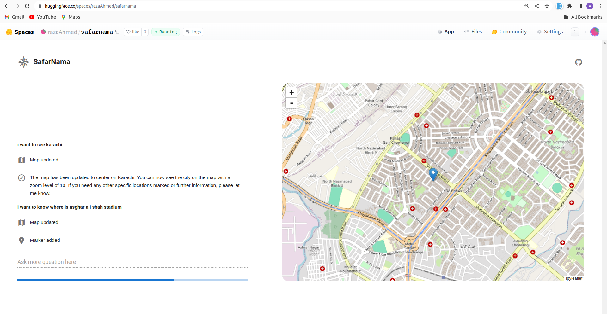

The program appears to be a Python-based web application that combines mapping functionalities with an AI conversational agent powered by OpenAI's GPT model. Here's a brief overview of its features:

SafarNama: A Conversational Mapping Experience

Interactive Map Visualization: Users can view and interact with a map, thanks to the ipyleaflet library which is used for rendering maps.

Location-Based Interaction: The application allows users to centralize the map on specific geographical coordinates (latitude and longitude) and adjust the zoom level through an update_map function.

Marker Placement: Users can add markers with labels to specific locations on the map using the add_marker function, thereby marking points of interest or destinations.

AI-Powered Chat Interface: The application integrates with OpenAI's GPT-4 model to provide an AI assistant within a chat interface. Users can input text and receive replies from the assistant, facilitating a natural-language based interaction with the map.

Reactivity and State Management: The code uses the solara.reactive mechanism to maintain and update the state of various elements like messages, zoom levels, map centers, and markers.

Custom Commands for AI Assistant: The AI assistant can perform certain actions through custom tools defined in the code (update_map, add_marker) which allow the assistant to modify the map based on user queries.

Asynchronous Processing: The integration with OpenAI includes asynchronous polling for completion of tasks, affording the communication with OpenAI's API to be non-blocking.

Error Handling: The ChatInterface component manages any errors encountered during interaction, ensuring a smooth user experience despite potential issues.

Styling: The appearance of the app is customizable via CSS provided as a string loaded from an external file (style.css).
The application is known as "SafarNama", which suggests a theme of exploration or travel. Users can benefit from both an interactive map to visualize their journey and an AI assistant to guide them through inquiries and provide information, creating an integrated platform for exploring locations and data-driven insights.

https://huggingface.co/spaces/razaAhmed/safarnama
